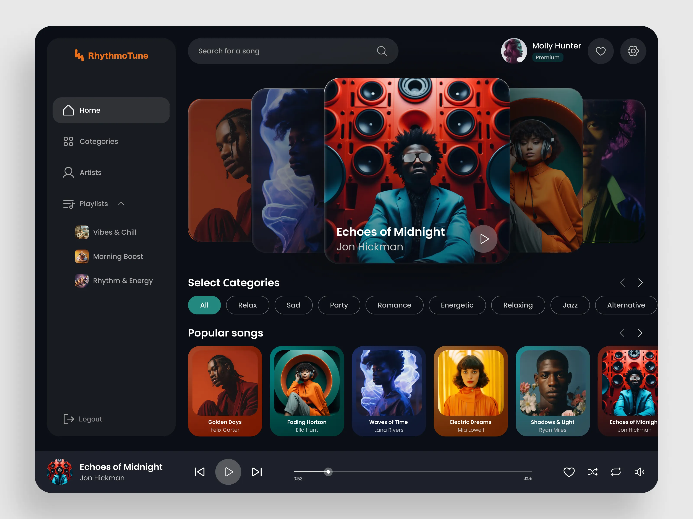

# Dotify 🎵

Dotify is a modern, single-page application built using Docker, GraphQL, and the MERN stack (MongoDB, Express, React, Node). Inspired by the concept and style of Spotify, it allows users to explore, play, and manage their favorite music seamlessly.



## 🚀 How It Works

To explore the most up-to-date version of Dotify, please visit the [homepage](https://github.com/naveencreation/MERN-Spotify-Dotify).

## 🛠️ Technologies Used

- **Routing**: Express
- **Database**: MongoDB, GraphQL
- **Libraries**: Mongoose, React
- **Server Environment**: Node.js
- **Storage**: AWS S3
- **Containerization**: Docker

## 🌟 Feature Spotlight

- 🎵 Users can create playlists.
- 🔍 Search functionality for albums, songs, and favorites.
- ▶️ Play albums and individual songs.
- 📋 Album detail pages with song lists.
- 🎼 Interactive player component.
- 🔐 Secure user authentication.

## 📚 Installation & Setup

1. Clone the repository:

    ```bash
    git clone https://github.com/naveencreation/MERN-Spotify-Dotify.git
    cd dotify
    ```

2. Set up environment variables:

    Create a `.env` file in the root directory with the following:

    ```env
    MONGO_URI=your-mongodb-uri
    AWS_ACCESS_KEY_ID=your-aws-access-key
    AWS_SECRET_ACCESS_KEY=your-aws-secret-key
    GRAPHQL_ENDPOINT=your-graphql-endpoint
    JWT_SECRET=your-jwt-secret
    ```

3. Run the application using Docker:

    ```bash
    docker-compose up --build
    ```

4. Access the application at `http://localhost:3000`.

## 📷 Preview


## 🤝 Contributing

Contributions are welcome! Feel free to open an issue or submit a pull request.

## 📜 License

This project is licensed under the [MIT License](LICENSE).

---

Crafted with ❤️ by [Naveen S](https://github.com/naveencreation)
